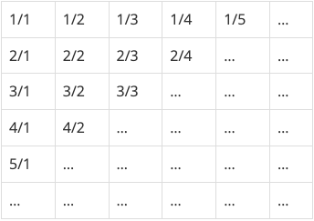

### 분수찾기

## 문제

무한히 큰 배열에 다음과 같이 분수들이 적혀있다.



이와 같이 나열된 분수들을 1/1 → 1/2 → 2/1 → 3/1 → 2/2 → … 과 같은 지그재그 순서로 차례대로 1번, 2번, 3번, 4번, 5번, … 분수라고 하자.

X가 주어졌을 때, X번째 분수를 구하는 프로그램을 작성하시오.

## 입력

```
첫째 줄에 X(1 ≤ X ≤ 10,000,000)가 주어진다.
```

## 출력

```
첫째 줄에 분수를 출력한다.
```

## 예제 입력

```
4
```

## 예제 출력

```
3/1
```

## 풀이

```js
이 문제는 대각선으로 등차수열을 이루고있다. 1, 2, 3, 4, 5... 공차는 1이다.

홀수는 아래에서 위로, 짝수는 위에서 아래로 이동한다.

홀수의경우 분모가 1부터 시작하고 짝수는 그반대인 분자가 1부터 시작한다.

N번째를 구하려면 일단 N번째는 어느 층에 속하는지 (1,2,3,4,5...) 알아야한다.

층수를 구하면 그 이전층까지의 개수들의 총합을 구하고 N에서 그 총합을빼면

N이속한 층에서 몇번째인지 구할 수 있다.

등차수열에서 1 ~n 까지의 총개수를 구하는 식은 (n * (n+1)) / 2 이다.

번외로 n ~m 까지의 총개수를 구하는 방법은 (((m-n)+1) * (n+m)) / 2이다.

몇층에 몇번째인지 구했으니 짝수, 홀수에 따라 분모, 분자를 계산한다.
```

## 내 제출

```js
const fs = require('fs');
const input = fs.readFileSync('예제.txt').toString().trim();

let layer = 1;
let index = 0;
let numerator = 0;
let denominator = 0;
let result = '';

while (Math.floor((layer * (layer + 1)) / 2) < input) layer++;
index = Math.abs(Math.floor(((layer - 1) * layer) / 2) - input);

if (layer % 2 === 0) {
    numerator = index;

    if (index === 1) denominator = layer;
    else denominator = layer - index + 1;

    console.log(`${numerator}/${denominator}`);
} else {
    denominator = index;

    if (index === 1) numerator = layer;
    else numerator = layer - index + 1;

    console.log(`${numerator}/${denominator}`);
}
```
