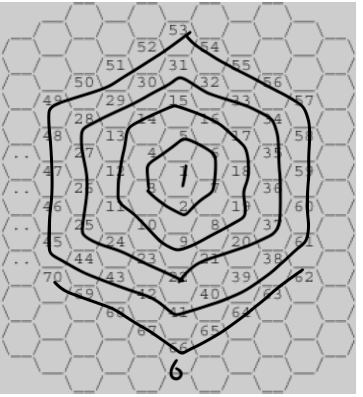

### 벌집

## 문제



```
위의 그림과 같이 육각형으로 이루어진 벌집이 있다. 그림에서 보는 바와 같이 중앙의 방 1부터 시작해서 이웃하는 방에 돌아가면서 1씩 증가하는 번호를 주소로 매길 수 있다. 숫자 N이 주어졌을 때, 벌집의 중앙 1에서 N번 방까지 최소 개수의 방을 지나서 갈 때 몇 개의 방을 지나가는지(시작과 끝을 포함하여)를 계산하는 프로그램을 작성하시오. 예를 들면, 13까지는 3개, 58까지는 5개를 지난다.
```

## 입력

```
첫째 줄에 N(1 ≤ N ≤ 1,000,000,000)이 주어진다.
```

## 출력

```
입력으로 주어진 방까지 최소 개수의 방을 지나서 갈 때 몇 개의 방을 지나는지 출력한다.
```

## 예제 입력

```
13
```

## 예제 출력

```
3
```

## 풀이

```js
벌집이 계속 커질때를 자세하게보면

1, 7, 19, 37, 61 다음에 벌집 크기가 커진다.

이것은 1, 2 ~7, 8 ~19, 20 ~37, 38 ~61, 61 ~... 를 의미하며

입력예제인 13은 8 ~19에 포함되고, 58은 38 ~61에 포함된다.

규칙성을 찾아보면, 이전항 + 6n 이라는 공식이 나옴.

ex) 이동거리가 3인 요소의 범위를 구하려면 7, 그리고 6 * 2을 하여 7 + 12 = 19가 나오게된다.

반복문을 계속돌려 구하고자하는 숫자보다 조건의 식이 작다면 계속 n을 증가시키면서 반복한다.

그리고 조건문을 탈출했을때 n은 구하고자 하는 숫자의 바로 전 범위이기 때문에 + 1을 하여 출력한다.
```

## 내 제출

```js
const fs = require('fs');
const input = fs.readFileSync('예제.txt').toString().trim();
let sum = 1;
let n = 0;
while (sum + 6 * n < +input) {
    sum += 6 * n;
    n++;
}
console.log(n + 1);
```
