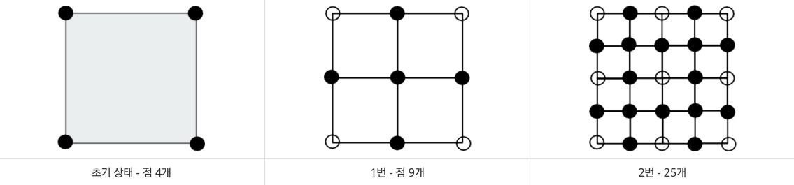

### 중앙 이동 알고리즘

## 문제

```
상근이는 친구들과 함께 SF영화를 찍으려고 한다. 이 영화는 외계 지형이 필요하다.

실제로 우주선을 타고 외계 행성에 가서 촬영을 할 수 없기 때문에, 컴퓨터 그래픽으로 CG처리를 하려고 한다.

외계 지형은 중앙 이동 알고리즘을 이용해서 만들려고 한다.

알고리즘을 시작하면서 상근이는 정사각형을 이루는 점 4개를 고른다. 그 후에는 다음과 같은 과정을 거쳐서 지형을 만든다.

정사각형의 각 변의 중앙에 점을 하나 추가한다.

정사각형의 중심에 점을 하나 추가한다.

초기 상태에서 위와 같은 과정을 한 번 거치면 총 4개의 정사각형이 새로 생긴다.

이와 같은 과정을 상근이가 만족할 때 까지 계속한다.

아래 그림은 과정을 총 2번 거쳤을 때까지의 모습이다.
```



```
상근이는 어떤 점은 한 개 보다 많은 정사각형에 포함될 수 있다는 사실을 알았다.

메모리 소모량을 줄이기 위해서 중복하는 점을 한 번만 저장하려고 한다.

과정을 N번 거친 후 점 몇 개를 저장해야 하는지 구하는 프로그램을 작성하시오.
```

## 입력

```
첫째 줄에 N이 주어진다. (1 ≤ N ≤ 15)
```

## 출력

```
첫째 줄에 과정을 N번 거친 후 점의 수를 출력한다.
```

## 예제 입력

```
3
```

## 예제 출력

```
1089
```

## 풀이

```js
정사각형, 점의개수에 너무 초점을 맞추니 답이안보였다.

정사각형이니 한변만 보자.

한변에 점이 2개 있고, 총 점의 개수는 4

중앙이동 1번째 - 한변에 점이 3개 점의 개수는 9

중앙이동 2번째 - 한변에 점이 5개 있고 점의 개수는 25

한변의 점의 개수의 제곱이다.

테스트 케이스에 중앙이동 5번째 점의개수가 1089이다.

이 뜻은 어떤 한변의 점의 개수를 제곱했더니 1089라는 뜻이다.

테스트 케이스로 답을 유추하는것은 옳지 않지만 33의 제곱이 1089이다.

중앙이동을 5번 했을때, 한 변의 점의 개수가 33개 라는 뜻

두 점의 기준 가운데 하나의 점을 그릴 수 있다.

한 변에 점이 4개 일 때 o-o-o-o, 2개의 점사이에 점을 하나다 찍을 수 있다. o-x-o-x-o-x-o 편의상 x로 찍었다.

한변의 개수는 7개가 된다. 여기서 한변의 개수를 구하는 공식을 알 수 있다.

다음 중앙이동 했을때 한변의 수는 현재 한 변의 점의 수 + (현재 한 변이 점의 수 - 1개)이다.

시작이 2이고, 다음 한 변의 점의 개수는 2 + (2 - 1) = 3 (중앙이동 1번째)

3 + (3 - 1) = 5 (중앙이동 2번째)

5 + (5 - 1) = 9 (중앙이동 3번째)

9 + (9 - 1) = 17 (중앙이동 4번째)

17 + (17 - 1) = 33 (중앙이동 5번째)

총 점의 개수는 한 변의 점의 개수 제곱이니 33의 제곱은 1089이므로 위와 같은 공식으로 N 번째 중앙이동 했을 때,

한 변의 점의 개수를 구하여 제곱하면 답이된다.
```

## 내 제출

```js
const fs = require("fs");
const input = +fs.readFileSync("예제.txt").toString().trim();

let ans = 2;
for (let i = 0; i < input; i++) ans = ans + (ans - 1);

console.log(Math.pow(ans, 2));
```
